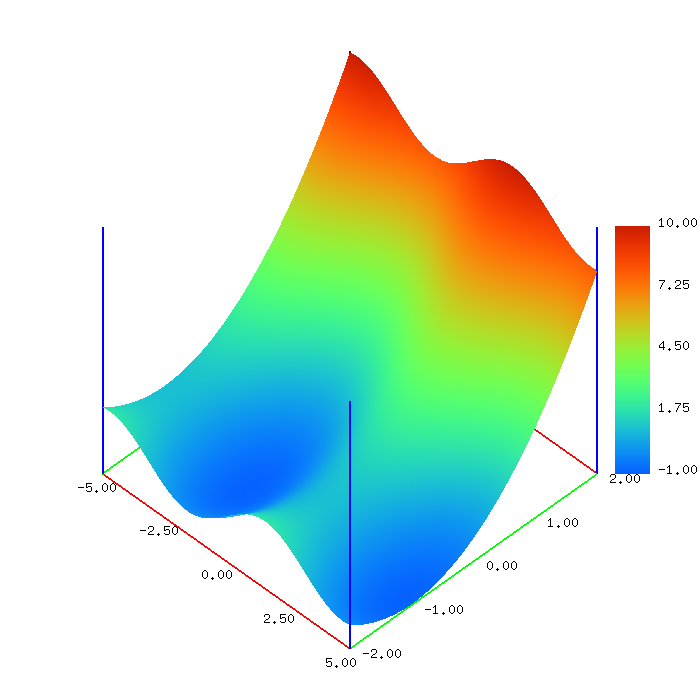

# 2変数関数の描画プログラム（3Dgraph）



## 環境

C言語+OpenGLの環境であれば動作する（はず）．
gcc用のMakefileを参考にコンパイルしてください．

## 使い方

次のようにコマンドライン引数を設定して実行する．
```
./3Dgraph.out func x_min x_max (x_num) y_min y_max (y_num)
```
例）
```
./3Dgraph.out "sin(x) + pow((y + 1), 2)" -5 5 -2 2
./3Dgraph.out "sin(sqrt(x*x+y*y)) / sqrt(x*x+y*y)" -20 20 100 -20 20 100
```

四則演算（`+,-,x,/`）と括弧（`(,)`）が使える．
また，次の関数が使える．自作の数式用eval関数を使っているためバグがある気がします．
`abs,fab,sqrt,sin,cos,tan,asin,acos,atan,sinh,cosh,tanh,asin,acosh,atanh,exp,log,log,ceil,floo,round,pow,atan2,hypot,mod,fmod`

|キー|動作                            |
|----|--------------------------------|
|x   |x軸方向に大きくする             |
|X   |x軸方向に小さくする             |
|y   |y軸方向に大きくする             |
|Y   |y軸方向に小さくする             |
|z   |z軸方向に大きくする             |
|Z   |Z軸方向に小さくする             |
|u   |グラフの拡大                    |
|U   |グラフの縮小                    |
|w   |ワイヤフレームの表示・非表示    |
|s   |サーフェイスモデルの表示・非表示|
|t   |目盛りの表示・非表示            |
|S   |画像の保存                      |
|Esc |プログラムの終了                |

マウスの左ドラッグでグラフの回転できる．
freeglut環境ではマウスのホイールでグラフの拡大，縮小できる．
